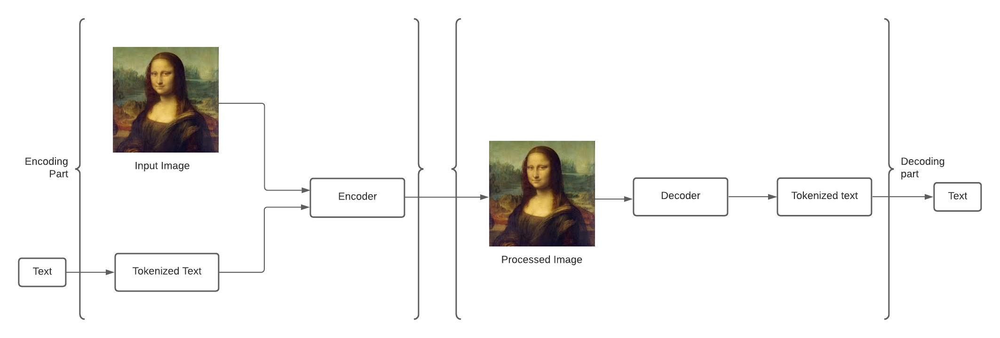
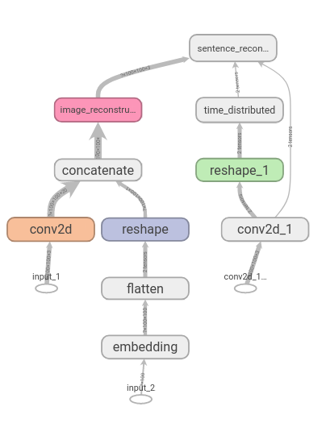
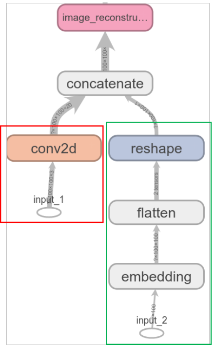
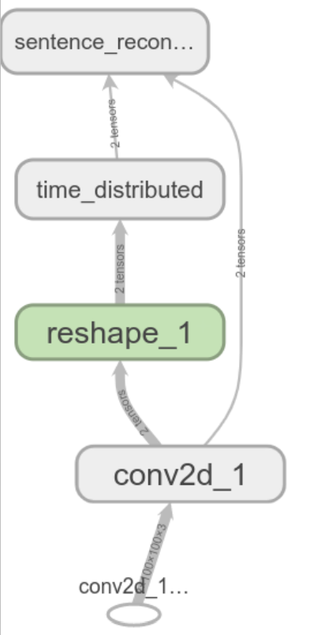
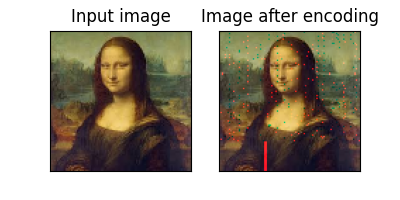

# Neural Steganography

## Problem Description
The goal is to train a neural network that takes an image and text as input and gives out an output image that must also contain the text encrypted in a certain way. Further, if we input that processed image into the model, we get the initially entered text as output. In order to train this model, we will require training data in the form of images and text so that the model learns effectively.

## Design Description
Below is a graphical representation of the model.

     
    Model Architecture

As we can see, it has two main parts; An Encoder and a Decoder. The encoder’s job is to take an image and a text as input and process them into an output image that contains the text encrypted in a unique way. 
The decoder’s job is to take that particular image (Output of the encoder) and decrypt it to the text. Both the encoder and decoder are combined into one big model which is trained on a collection of randomly generated images and text. Because the two models are combined and trained together, their weights are learnt in such a way so that the encryption “key” is same.

Lets break it down and understand :—

### Encoder

     
    Encoder Architecture

As the encoder has 2 inputs (image and text), the model has 2 separate layer branches to process each of the inputs. For image inputs, as shown in the red box, they go through a convolution layer. The text however, as shown in the green box, cannot be directly processed by the computer as it only deals with vectors and matrices. To achieve this, there were to methods to encode text. Either one hot encode the entire text OR first one hot encode an then run the text through an embedding layer. The embedding layer encodes text to vectors by learning from the text data itself. This is mainly preferred over one hot encoding because it decreases the size of the vector and is more efficient than the former method. Once the text is converted to a vector, it is flattened and reshaped in order to match the dimensions of the convolved matrix output from the convolution layer. After ensuring the dimensions, both text and image are concatenated into a single tensor. This tensor is the image we get after processing the input and can be used by people for information exchange.

### Decoder

     
    Decoder Architecture

For decoding, the image (encrypted) goes through a series of convolution layers. They are reshaped into a tensor that can be easily inputted into a time distributed layer. Time Distributed layer, in essence, takes a 3D tensor and outputs a sequence vector. The reason to output a sequence is because we not only want to decrypt words encrypted in the image but also their sequence. In other words, we also want information about the relative position of the words with respect to each other. The time-distributed layer does exactly that. It creates a mini recurrent neural network and churns out sequence of vectors based on the input.

## Results

Input Text: "This is a demo of my project which will encrypt this text into the image and later decrypt"

     
    Images

Decrypted text: "This is a demo of my project which will encrypt this text into the image and later decrypt"